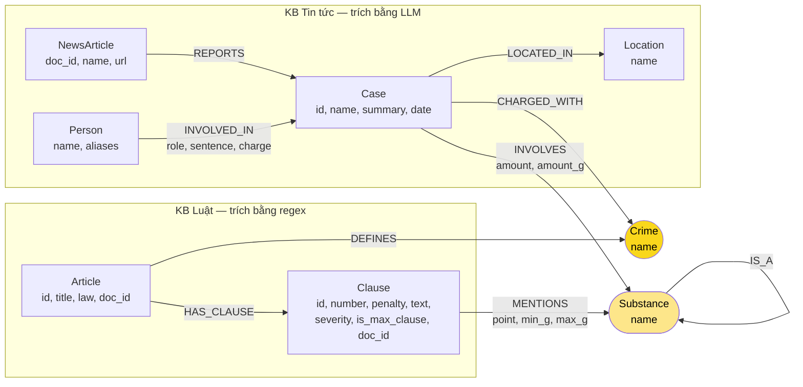

# Thiết kế Ontology — Day 19

**Họ tên:** Nguyễn Minh Tuấn  **MSSV:** 2A202602420

**Lựa chọn** (đánh dấu một):
- [ ] Dùng ontology gợi ý (có thể chỉnh nhỏ)
- [x] Tự thiết kế (xét bonus +15, xem `SUBMISSION.md`)

> Hướng dẫn: `LAB_GUIDE.md` Bước 2. Dùng ontology gợi ý thì vẫn phải điền đủ các mục dưới đây bằng lời của bạn.

**Cách tái tạo số liệu.** Cả hai ontology nằm trong `src/graph.py`, chọn bằng biến môi trường `KG_ONTOLOGY` (đọc lúc chạy):

```bash
python bench_kg.py --judge                                                     # ontology tự thiết kế (mặc định) -> ket_qua_benchmark_kg.txt
KG_ONTOLOGY=hint python bench_kg.py --judge --out ket_qua_benchmark_kg.hint.txt   # ontology gợi ý (baseline)
# PowerShell:  $env:KG_ONTOLOGY="hint"; python bench_kg.py --judge --out ket_qua_benchmark_kg.hint.txt; Remove-Item Env:KG_ONTOLOGY
```

- Nhánh `hint` giữ **nguyên văn** các hàm HINT của lab: `find_substances`, `parse_law_article`, `NEWS_EXTRACTION_PROMPT`, `extract_news_cases`, `add_law_article`, `add_news_case`, `suggested_constraints`.
- Hai nhánh dùng chung **một** sửa lỗi trong KG-3: dữ kiện multi-hop đứng trước, cạnh seed 1 bước đứng sau, nên khi cắt còn 60 dữ kiện thì cạnh seed bị cắt trước.
- Ngoài phần dùng chung đó, KG-3 của nhánh tự thiết kế được viết cho ontology mới. Chênh lệch giữa hai file kết quả đến từ ontology **cộng** 3 thay đổi truy vấn đi kèm:
  - bỏ cạnh của `Clause` khỏi phần seed;
  - với người được nêu tên trong câu hỏi, đi theo `INVOLVED_IN.charge` tới `Crime`;
  - liệt kê mọi vụ có chất được nêu trong câu hỏi.
- Cấu hình chung của hai lần chạy:
  - chat `gemini-3.1-flash-lite`, embedding `gemini-embedding-2`, `top_k=3`;
  - ontology tự thiết kế: KG 211 node / 443 cạnh;
  - ontology gợi ý: KG 201 node / 388 cạnh.
- Mọi kết quả Cypher bên dưới lấy trên graph của lần chạy tương ứng.

## 1. Sơ đồ



- **`Crime`** (vàng đậm) là **cầu nối chính**: luật nối vào bằng `DEFINES`, tin tức nối vào bằng `CHARGED_WITH`. Từ một người, KG-3 đi theo `INVOLVED_IN.charge` (tội của riêng người đó) tới đúng `Crime`.
- **`Substance`** (vàng nhạt) là **cầu nối định lượng**: ngưỡng khối lượng trên `MENTIONS` được so với số gam trên `INVOLVES`, để chọn đúng khoản luật áp dụng.

## 2. Entity types (node labels)

| Label | Ý nghĩa | Khóa định danh (`MERGE` theo) | Properties | Lấy từ KB nào | Trích bằng (regex / LLM / khác) |
| --- | --- | --- | --- | --- | --- |
| `Article` | Một Điều luật (BLHS Chương XX, Luật PCMT 2021 Chương I) | `id` (`"Điều 251 BLHS"`) | `id`, `title`, `law`, `doc_id` | Luật | Front matter của file |
| `Clause` | Một khoản trong Điều | `id` (`"Điều 251 BLHS khoản 1"`) | `id`, `number`, `penalty`, `text`, `severity`, `is_max_clause`, `doc_id` | Luật | Regex. `severity`: tử hình = 100, chung thân = 50, còn lại là số năm tù tối đa, không có hình phạt tù = 0. `is_max_clause` = khoản có `severity` lớn nhất trong Điều |
| `Crime` | Tội danh chuẩn, **cầu nối chính** | `name` qua `normalize_crime` | `name` | Luật (tiêu đề Điều "Tội …") | Regex; phía tin: LLM chọn từ danh sách, rồi qua `link_entity` |
| `Substance` | Chất ma túy, hoặc nhóm chất mà luật quy định chung | `name` chuẩn hóa | `name` | Cả hai | Luật: so khớp nguyên từ với `SUBSTANCES` + `SUBSTANCE_SYNONYMS` + nhóm `"chất ma túy khác (thể rắn)"`. Tin: `canonical_substance` (tiếng lóng → tên chuẩn, không phân biệt hoa/thường, bỏ từ chung chung như "ma túy") |
| `NewsArticle` | Một bài báo — **mới so với gợi ý** | `doc_id` | `doc_id`, `name` (tiêu đề), `url` | Tin | Metadata của file |
| `Case` | Một vụ việc ngoài đời, có thể được nhiều bài báo đưa tin | `id`. Gộp vào `Case` cũ nếu có chung bị cáo/bị can/nghi phạm (họ tên ≥ 2 chữ); nếu không thì `"<doc_id>#<thứ tự>"` | `id`, `name`, `summary`, `date` | Tin | LLM (JSON) + quy tắc gộp trong code |
| `Person` | Người liên quan tới vụ việc | `name`. Người mới khớp tên hoặc bí danh (≥ 2 chữ) với người cũ thì dùng node cũ, gộp `aliases` | `name`, `aliases` | Tin | LLM (JSON) + quy tắc gộp trong code |
| `Location` | Tỉnh/thành | `name` | `name` | Tin | LLM (JSON) |

**Số lượng node trên graph cuối:** `Clause` 99, `Person` 33, `NewsArticle` 20, `Article` 18, `Crime` 13, `Substance` 12, `Case` 10, `Location` 6.

**Node mang `doc_id`:** `Article`, `Clause` (phía luật) và `NewsArticle` (phía tin), mỗi node sinh từ đúng 1 tài liệu.

**Node dùng chung, không có `doc_id`:** `Case`, `Person`, `Crime`, `Substance`, `Location`. Riêng `Case` cố ý không có `doc_id`, vì một vụ có thể được nhiều bài báo đưa tin; nguồn của vụ nằm trên cạnh `REPORTS`.

## 3. Relationships

| Type | Từ → Đến | Properties trên cạnh | Ý nghĩa |
| --- | --- | --- | --- |
| `DEFINES` | `Article` → `Crime` | — | Điều luật định nghĩa tội danh |
| `HAS_CLAUSE` | `Article` → `Clause` | — | Điều gồm các khoản |
| `MENTIONS` | `Clause` → `Substance` | `point`, `min_g`, `max_g` | Điểm `point` của khoản nhắc tới chất; nếu luật nêu khối lượng thì có ngưỡng `[min_g, max_g)` tính bằng gam (`max_g` rỗng nghĩa là "trở lên") |
| `IS_A` | `Substance` → `Substance` | — | Chất thuộc nhóm luật quy định chung (Ketamine → "chất ma túy khác (thể rắn)") |
| `REPORTS` | `NewsArticle` → `Case` | — | Bài báo đưa tin về vụ việc |
| `CHARGED_WITH` | `Case` → `Crime` | — | Vụ bị điều tra/truy tố/xét xử về tội danh (gồm cả tội riêng của từng người) |
| `INVOLVES` | `Case` → `Substance` | `amount`, `amount_g` | Chất thu giữ: chuỗi gốc (`"hơn 9,6kg"`) và số gam do code parse (`9600.0`) |
| `LOCATED_IN` | `Case` → `Location` | — | Nơi xảy ra vụ việc |
| `INVOLVED_IN` | `Person` → `Case` | `role`, `sentence`, `charge` | Vai trò, mức án và tội danh **riêng** của người đó. Khi gộp nhiều bài, giữ giá trị không rỗng mới nhất |

**Số cạnh trên graph cuối:** `MENTIONS` 246, `HAS_CLAUSE` 99, `INVOLVED_IN` 33, `REPORTS` 14, `INVOLVES` 14, `CHARGED_WITH` 13, `DEFINES` 13, `LOCATED_IN` 10, `IS_A` 1.

## 4. Node cầu nối giữa 2 KB

- **Node nào:** `Crime` (cầu nối chính) và `Substance` (cầu nối định lượng).

- **Vì sao chọn:**
  - Tội danh là thực thể duy nhất có mặt ở cả 2 KB với cùng nghĩa: tiêu đề Điều luật và câu "bị tuyên … về tội …" trên báo. Từ một người, đường `Person -INVOLVED_IN{charge}-> Crime <-DEFINES- Article -HAS_CLAUSE-> Clause` đi tới khung hình phạt.
  - Riêng tội danh thì chưa chọn được khoản: Điều 250 có 4 khung phân theo khối lượng. Vì vậy cần thêm `Substance` có ngưỡng.

- **Cách khớp tên hai phía:**
  - **`Crime`:** `normalize_crime` cho tên chuẩn; prompt đưa sẵn danh sách 13 tội; mọi tội LLM trả về đều qua `link_entity` (khớp chính xác, rồi difflib ≥ 0.8, không đủ giống thì `None`).
  - **`Substance`:** `canonical_substance` làm lần lượt:
    1. tra từ điển tiếng lóng (`thuốc lắc` → MDMA, `đá` → Methamphetamine…);
    2. so khớp nguyên từ, không phân biệt hoa/thường;
    3. dùng difflib;
    4. bỏ từ chung chung ("ma túy", "ma túy tổng hợp").

    Chất mà luật chỉ quy định chung (Ketamine) nối qua `IS_A` vào nhóm "chất ma túy khác (thể rắn)".

- **Khi nào cầu gãy, và xử lý:**

  ```cypher
  MATCH (k:Case) WHERE NOT (k)-[:CHARGED_WITH]->()
  RETURN k.name, [(n:NewsArticle)-[:REPORTS]->(k) | n.doc_id] AS reported_by;
  ```

  ```
  Vụ phát hiện bao tải nghi chứa 20kg ma túy tại Phú Quốc (ngày 27-9)   | ['news-100260927182621527']
  Vụ phát hiện kiện hàng nghi chứa 20kg ma túy tại Phú Quốc (ngày 25-9) | ['news-100260927182621527']
  ```

  - Hai vụ này **gãy hợp lý**: chưa có đối tượng nên chưa có tội danh.
  - Ở graph ontology gợi ý có 4 vụ gãy. Hai vụ thừa ra ("Vụ bắt giữ 126 người…", "Vụ bắt giữ Nguyễn Minh Đức…") sinh từ **đoạn teaser** ở cuối bài báo khác.
  - Ontology mới xử lý bằng hai lớp:
    - (a) prompt yêu cầu bỏ qua đoạn tin liên quan;
    - (b) nếu LLM vẫn trích đoạn đó, `Case` được gộp vào vụ thật nhờ chung bị can.
  - Khi `Crime` gãy, `Substance` vẫn nối vụ sang khoản luật qua ngưỡng khối lượng.

## 5. Competency questions

Mọi đường đi dưới đây đã chạy trên graph cuối và cho kết quả như ghi trong cột thứ ba.

| Câu | Đường đi (Cypher pattern) | Trả lời được? |
| --- | --- | --- |
| Q1 | `(:Article {id:'Điều 2 Luật PCMT'})-[:HAS_CLAUSE]->(cl:Clause {number:4})` → `cl.text` | **Graph có dữ liệu** ("4. Tiền chất là hóa chất không thể thiếu được…"), nhưng câu này không cần cầu nối. KG-3 không đưa text khoản Luật PCMT vào prompt, nên câu trả lời dựa vào chunk vector. Ontology gợi ý cũng vậy |
| Q2 | `(:NewsArticle {doc_id:'news-100260928173914514'})-[:REPORTS]->(k:Case)<-[r:INVOLVED_IN]-(p:Person) WHERE r.sentence CONTAINS 'tử hình'` | **Có:** Trần Thanh Tuấn, Trần Minh Tâm — `sentence = 'tử hình'` |
| Q3 | `(p:Person {name:'Lê Minh Thành'})-[r:INVOLVED_IN]->(:Case)`, `(:Crime {name: r.charge})<-[:DEFINES]-(a:Article)-[:HAS_CLAUSE]->(cl:Clause {number:1})` | **Có:** `36 tháng tù`, `Điều 251 BLHS`, khoản 1 `phạt tù từ 02 năm đến 07 năm` |
| Q4 | `(p:Person)-[r:INVOLVED_IN]->(:Case) WHERE 'Hoàng Nato' IN p.aliases`, `(:Crime {name: r.charge})<-[:DEFINES]-(a:Article)-[:HAS_CLAUSE]->(cl:Clause {is_max_clause: true})` | **Có**, và **ontology gợi ý trả lời thiếu**: Dương Minh Tuấn → `tổ chức sử dụng…` → Điều 255 khoản 4 `phạt tù 20 năm hoặc tù chung thân`. Ontology gợi ý không có khung cao nhất (xem mục 7) |
| Q5 | `(:Person {name:'Cái Quang Huy'})-[:INVOLVED_IN]->(k:Case)-[i:INVOLVES]->(s)`, `(s)-[:IS_A*0..1]->()<-[m:MENTIONS]-(cl)<-[:HAS_CLAUSE]-(a)-[:DEFINES]->()<-[:CHARGED_WITH]-(k) WHERE i.amount_g >= m.min_g AND (m.max_g IS NULL OR i.amount_g < m.max_g)` | **Có, graph tự chọn khoản**: MDMA `hơn 9,6kg` = 9600 g ≥ 100 g → Điều 250 khoản 4 điểm b; Ketamine 406 g ≥ 300 g → khoản 4 điểm e. Ontology gợi ý: cùng truy vấn **không ra bản ghi nào** |
| Q6 | `MATCH (k:Case)-[i:INVOLVES]->(:Substance {name:'MDMA'}) RETURN k.name, i.amount` | **Có, không trùng:** đúng 3 vụ (Cái Quang Huy, nhóm Lê Minh Thành, Viện Pháp y tâm thần — vụ này 2 bài báo). Ontology gợi ý trả về 5 node `Case` cho 3 vụ đó |

## 6. Quyết định thiết kế và đánh đổi

1. **Ngưỡng khối lượng là property trên `MENTIONS`, không phải node riêng.**
   - *Phương án khác:* node `Threshold`/`Point` cho từng điểm, nối tới `Clause` và `Substance`.
   - *Vì sao:* một ngưỡng luôn gắn với đúng một cặp (khoản, chất), nên đặt trên cạnh là đủ. Truy vấn chọn khoản chỉ cần một điều kiện `WHERE` (Q5). Thêm node sẽ làm đường đi dài thêm 1 bước mà không thêm thông tin.
   - *Đánh đổi:*
     - Cùng một chất có thể có nhiều cạnh `MENTIONS` tới cùng khoản, mỗi cạnh một điểm: `cần sa` vừa là "nhựa cần sa" (gam) vừa là "lá cần sa" (kilôgam). Vì vậy số cạnh `MENTIONS` tăng từ 169 lên 246.
     - Ontology không phân biệt dạng chất.

2. **Khung cao nhất = khoản có mức hình phạt chính nặng nhất (`severity`), không dùng từ khóa.**
   - *Phương án khác:* đánh dấu theo vị trí (khoản cuối) hoặc theo từ khóa ("tử hình", "chung thân", "20 năm"). Bản nháp trước dùng cách này và đánh dấu thừa khoản 3 ("15–20 năm") cùng khoản 5 (phạt tiền).
   - *Vì sao:* `severity` so sánh được, và đảm bảo **mỗi Điều BLHS có đúng 1 khoản** khung cao nhất (13/13 Điều).
   - *Đánh đổi:* hình phạt bổ sung (phạt tiền, cấm cư trú) có `severity = 0`. Câu hỏi về hình phạt bổ sung phải dùng `text`.

3. **Thêm `NewsArticle` và tách `Case` khỏi bài báo; gộp vụ theo bị can chung.**
   - *Phương án khác:* `Case` khóa theo tên do LLM đặt (như gợi ý), hoặc khóa theo `(doc_id, thứ tự)` mà không gộp.
   - *Vì sao:* một vụ án thật được nhiều bài đưa tin (Hoàng Nato: 4 bài), mà mỗi bài LLM đặt tên vụ một kiểu. Bị can có họ tên đầy đủ là định danh ổn định hơn tên vụ.
   - *Đánh đổi:*
     - Có thể gộp nhầm hai vụ khác nhau của cùng một người (tái phạm). Đã giảm rủi ro bằng cách chỉ xét vai trò bị cáo/bị can/nghi phạm và tên ≥ 2 chữ.
     - Kết quả phụ thuộc thứ tự nạp bài (theo `doc_id`, cũng là thứ tự đăng).

4. **Tội danh cá nhân vẫn là property `charge` trên `INVOLVED_IN`, nhưng KG-3 đi theo nó tới `Crime`.**
   - *Phương án khác:* node `Charge` riêng (Person → Charge → Crime, có giai đoạn tố tụng).
   - *Vì sao:* một vụ có thể bị truy tố nhiều tội (vụ Hoàng Nato: 3 tội), nhưng câu hỏi về một người cần **tội của người đó**. Truy vấn `(:Crime {name: r.charge})` cho đúng Điều 255 mà không cần thêm node.
   - *Đánh đổi:* mỗi người chỉ giữ 1 tội và 1 mức án cho mỗi vụ; không lưu giai đoạn tố tụng.

5. **Chuẩn hóa chất ở cả hai phía bằng cùng một hàm, bỏ tên chung chung.**
   - *Phương án khác:* để LLM tự chuẩn hóa (như gợi ý).
   - *Vì sao:* ontology gợi ý sinh node `ma túy` và tách `methamphetamine` khỏi `Methamphetamine`; mỗi node như vậy là một cầu gãy (law = 0).
   - *Đánh đổi:* từ điển tiếng lóng phải duy trì bằng tay; chất lạ (`etomidate`) vẫn thành node riêng, không nối được luật.

## 7. So với ontology gợi ý (bắt buộc nếu xét bonus)

**Nguồn số liệu:**
- "Trước" lấy từ `ket_qua_benchmark_kg.hint.txt` và graph của lần chạy đó; "sau" lấy từ `ket_qua_benchmark_kg.txt` và graph của lần chạy đó.
- Hai lần chạy cùng model, cùng embedding, cùng cách sắp thứ tự dữ kiện trong KG-3.
- Phía Flat RAG ra cùng recall 0.58, judge 1.33, 657 token, $0.00025 ở cả hai lần; chỉ thời gian khác (2.53 s và 2.40 s).
- Số dữ kiện `context()` ghi dưới đây đo bằng `doc_id` chọn tay (Q4: hai bài `news-100260920221957595` và `news-100260922111804786`), không phải top-k thật của benchmark.

Bốn dòng đầu của bảng là khác biệt về **ontology**. Dòng cuối là thay đổi **KG-3** đi kèm, dùng property `charge` mà ontology gợi ý cũng có.

| Điểm khác | Gợi ý làm gì | Bạn làm gì | Vấn đề nó giải quyết | Bằng chứng (Cypher, hoặc số liệu benchmark) |
| --- | --- | --- | --- | --- |
| Ngưỡng khối lượng | `MENTIONS` không có property; `INVOLVES.amount` là chuỗi | `MENTIONS {point, min_g, max_g}` (regex trên điểm luật) + `INVOLVES.amount_g` (parse "hơn 9,6kg" → 9600) | Graph không chọn được khoản theo khối lượng (Q5) | Cypher Q5 ở mục 5. **Trước:** MDMA ở Điều 250 có `min_g = None` ở cả 4 khoản, truy vấn chọn khoản ra `(no records)`; GraphRAG phải tự suy luận và dẫn nhầm "điểm b khoản 4 **Điều 248**". **Sau:** truy vấn trả về `Điều 250 BLHS, khoản 4, điểm b, 100 g` cho MDMA 9600 g; GraphRAG dẫn đúng "điểm b khoản 4 Điều 250" |
| Khung cao nhất | Không có; KG-3 chỉ lấy khoản 1 + khoản `MENTIONS` chất của vụ | `Clause.severity` + `is_max_clause` (đúng 1 khoản/Điều); KG-3 luôn lấy khung cơ bản + khung cao nhất | Điều 255 không có khoản nào nhắc chất nên mất khung tối đa (Q4, lỗi E2) | Q4 GraphRAG **trước:** recall 0.67, judge 1, "không đủ thông tin để xác định mức phạt tù tối đa". **Sau:** recall 1.00, judge 2, "mức phạt tù tối đa là 20 năm hoặc tù chung thân (theo khoản 4)" |
| `NewsArticle` + gộp `Case` | `Case` khóa theo tên LLM đặt, `doc_id` trên `Case` | `NewsArticle -REPORTS-> Case`; `Case` gộp theo bị can chung; `Person` gộp theo bí danh | Một vụ thành nhiều node (E3), vụ rác từ đoạn teaser | Hoàng Nato: **trước** 4 node `Case` (4 bài), **sau** 1 node có 4 `REPORTS`. Tổng `Case` 17 → 10. Q6 GraphRAG **trước** liệt kê 5 vụ (Cái Quang Huy ×2, Viện Pháp y ×2), recall 0.67; **sau** liệt kê đúng 3 vụ, recall 1.00, judge 2 |
| Chuẩn hóa chất + nhóm `IS_A` | LLM tự đặt tên chất; `find_substances` so chuỗi con | `canonical_substance` dùng chung 2 phía; Ketamine `IS_A` "chất ma túy khác (thể rắn)" | Node chất trùng/rác không nối được luật; Ketamine không có khoản nào | **Trước:** có node `ma túy` (law 0); Ketamine law 0. **Sau:** không còn `ma túy`; Ketamine đi qua `IS_A` tới ngưỡng 1–20 / 20–100 / 100–300 / ≥300 g của Điều 250 và chọn được khoản 4 cho 406 g |
| *(KG-3, không phải ontology)* Tội danh của người → Điều | KG-3 lấy luật theo **mọi** tội của vụ | KG-3 đi `INVOLVED_IN.charge → Crime` cho người được nhắc trong câu hỏi | Vụ nhiều tội làm prompt lẫn Điều không liên quan | `context()` Q4 với `doc_id` chọn tay: **trước** có khoản của Điều 249, 251, 255 (36 dữ kiện); **sau** chỉ Điều 255 (7 dữ kiện). Input token trung bình mỗi câu của GraphRAG trong benchmark: 2678 → 1430 (−47%). Mức giảm này là tác động chung của ontology và các thay đổi KG-3 |

**Tổng benchmark GraphRAG:**

| | Recall | Judge | in_tok/câu | USD/câu |
| --- | --- | --- | --- | --- |
| Ontology gợi ý | 0.89 | 1.83 | 2678 | $0.00088 |
| Ontology tự thiết kế | 1.00 | 2.00 | 1430 | $0.00055 |

Chi phí dựng KG gần như không đổi ($0.01774 → $0.01741).

## 8. Hạn chế còn lại

- **Ngưỡng chỉ có ở dạng chất rắn tính bằng gam/kilôgam.** Chất lỏng (mililít), "02 chất trở lên cộng dồn" và dạng chất (nhựa/lá cần sa) chưa được mô hình hóa. `cần sa` có nhiều ngưỡng trên cùng khoản.
- **Số lượng phải có đơn vị khối lượng.** "5 viên", "nửa chỉ" có `amount_g` rỗng, nên vụ nhóm Lê Minh Thành không chọn được khoản theo khối lượng; KG-3 chỉ đưa khung cơ bản và khung cao nhất.
- **Gộp vụ dựa vào bị can chung.** Vụ không nêu tên đối tượng (2 vụ Phú Quốc) không gộp được, và người tái phạm có thể bị gộp nhầm hai vụ.
- **Một tội và một mức án mỗi người mỗi vụ; không có giai đoạn tố tụng.** Hai bị cáo vụ Viện Pháp y (Ngô Việt Dũng, Nguyễn Thị Mai Anh) có `charge` rỗng vì bài báo không nêu tội của riêng họ:

  ```cypher
  MATCH (p:Person)-[r:INVOLVED_IN]->(k:Case)
  WHERE r.role IN ['bị cáo','bị can','nghi phạm'] AND r.charge = ''
  RETURN p.name, r.role, k.name;
  ```

- **Chất ngoài danh sách** (`etomidate`) vẫn là node riêng, không nối được luật.
- **Câu hỏi định nghĩa (Q1) không dùng graph.** Text khoản Luật PCMT có trong `Clause.text` nhưng KG-3 không đưa vào prompt.
