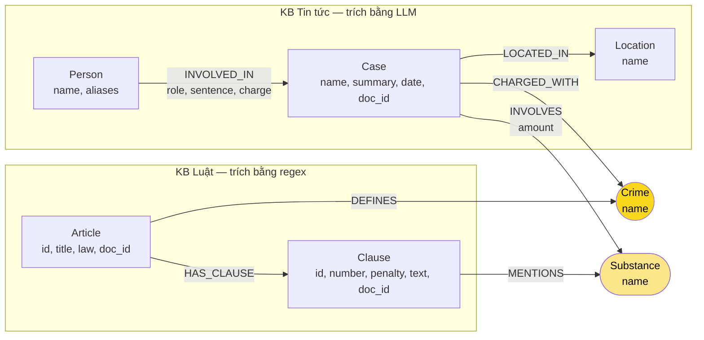

# Thiết kế Ontology — Day 19

**Họ tên:** Nguyễn Minh Tuấn  **MSSV:** 2A202602420

**Lựa chọn** (đánh dấu một):
- [x] Dùng ontology gợi ý (có thể chỉnh nhỏ)
- [ ] Tự thiết kế (xét bonus +15, xem `SUBMISSION.md`)

> Hướng dẫn: `LAB_GUIDE.md` Bước 2. Dùng ontology gợi ý thì vẫn phải điền đủ các mục dưới đây bằng lời của bạn.

## 1. Sơ đồ



- **Crime** (vàng đậm) là **node cầu nối chính**: luật nối vào bằng `DEFINES`, tin tức nối vào bằng `CHARGED_WITH`.
- **Substance** (vàng nhạt) là **cầu nối phụ**: dùng chung giữa 2 KB, KG-3 dùng nó để chọn khoản luật phù hợp với chất của vụ.

## 2. Entity types (node labels)

| Label | Ý nghĩa | Khóa định danh (`MERGE` theo) | Properties | Lấy từ KB nào | Trích bằng (regex / LLM / khác) |
| --- | --- | --- | --- | --- | --- |
| `Article` | Một Điều luật (BLHS Chương XX hoặc Luật PCMT 2021 Chương I) | `id`, ví dụ `"Điều 251 BLHS"`, `"Điều 2 Luật PCMT"` | `id`, `title`, `law`, `doc_id` | Luật | Front matter của file (`article`, `title`, `law`) |
| `Clause` | Một khoản trong Điều | `id`, ví dụ `"Điều 251 BLHS khoản 1"` | `id`, `number`, `penalty`, `text`, `doc_id` | Luật | Regex: tách khoản theo `^(\d+)\.\s`; lấy khung phạt từ dòng đầu khoản theo `bị (phạt\|tù\|cảnh cáo)…` |
| `Crime` | Tội danh chuẩn, **node cầu nối** | `name` đã chuẩn hóa bằng `normalize_crime` (chữ thường, bỏ tiền tố "Tội ") | `name` | Luật (tiêu đề Điều bắt đầu bằng "Tội "); tin tức chỉ nối vào tên có sẵn | Regex + `normalize_crime`; phía tin: LLM chọn từ danh sách, rồi qua `link_entity` |
| `Case` | Một vụ việc được kể trong bài báo | `name` (do LLM đặt) | `name`, `summary`, `date`, `doc_id`, `source_title` | Tin | LLM (JSON) |
| `Person` | Người liên quan tới vụ việc (bị cáo, nghi phạm, người liên quan…) | `name` | `name`, `aliases` | Tin | LLM (JSON) |
| `Location` | Tỉnh/thành nơi xảy ra vụ việc | `name` | `name` | Tin | LLM (JSON) |
| `Substance` | Chất ma túy | `name` | `name` | Cả hai | Luật: `find_substances` (so khớp danh sách `SUBSTANCES`); Tin: LLM, được yêu cầu dùng tên chuẩn trong danh sách |

Phía luật trích bằng regex nên số lượng cố định qua mọi lần chạy: **18 `Article`** (13 Điều BLHS + 5 Điều Luật PCMT), **99 `Clause`**, **13 `Crime`**. Số `Case`, `Person`, `Location`, `Substance` phụ thuộc LLM.

`Crime`, `Substance`, `Person`, `Location` **không có `doc_id`**, vì chúng là node dùng chung giữa nhiều tài liệu (một tội danh, một chất hay một người có thể xuất hiện ở nhiều bài). Mỗi label có một `CONSTRAINT … IS UNIQUE` trên khóa của nó (`suggested_constraints`).

## 3. Relationships

| Type | Từ → Đến | Properties trên cạnh | Ý nghĩa |
| --- | --- | --- | --- |
| `DEFINES` | `Article` → `Crime` | — | Điều luật định nghĩa tội danh (13 cạnh, mỗi Điều BLHS một tội; Điều của Luật PCMT không định nghĩa tội) |
| `HAS_CLAUSE` | `Article` → `Clause` | — | Điều gồm các khoản |
| `MENTIONS` | `Clause` → `Substance` | — | Khoản có nêu tên chất (ngưỡng khối lượng vẫn nằm trong `text` của khoản) |
| `CHARGED_WITH` | `Case` → `Crime` | — | Vụ việc bị điều tra/truy tố/xét xử về tội danh (đã map về tên chuẩn của luật) |
| `INVOLVES` | `Case` → `Substance` | `amount` | Chất thu giữ trong vụ, kèm khối lượng dạng chuỗi, ví dụ `"hơn 9,6kg"` |
| `LOCATED_IN` | `Case` → `Location` | — | Nơi xảy ra hoặc xét xử vụ việc |
| `INVOLVED_IN` | `Person` → `Case` | `role`, `sentence`, `charge` | Vai trò, mức án và tội danh **riêng** của từng người trong vụ |

## 4. Node cầu nối giữa 2 KB

- **Node nào:** `Crime` là cầu nối chính. `Substance` là cầu nối phụ, dùng để lọc khoản.

- **Vì sao chọn node này:**
  - Tội danh là thứ duy nhất xuất hiện ở **cả hai** KB với cùng một nghĩa:
    - luật đặt tên tội ở tiêu đề Điều ("Điều 251. Tội mua bán trái phép chất ma túy");
    - báo viết "bị tuyên … về tội mua bán trái phép chất ma túy".
  - Tên người và mức án chỉ có trong tin; khung hình phạt chỉ có trong luật.
  - Đi qua `Crime` thì từ một người tới được khung hình phạt trong 4 cạnh: `Person → Case → Crime ← Article → Clause`.
  - Tên tội danh cũng ổn định hơn tên chất: luật dùng đúng một cách gọi, còn tên chất trong báo rất đa dạng ("ma túy tổng hợp", "ma túy đá"…).

- **Cách đảm bảo hai phía khớp tên:**
  1. Phía luật: `normalize_crime(title)` cho ra 13 tên chuẩn. Chỉ luật mới sinh ra tên tội mới.
  2. Prompt trích xuất tin đưa nguyên danh sách 13 tên chuẩn và yêu cầu "BẮT BUỘC chọn đúng nguyên văn từ DANH SÁCH TỘI DANH".
  3. LLM không phải lúc nào cũng tuân thủ, nên mọi `charges` của vụ và `charge` của từng người đều đi qua `link_entity`:
     - chuẩn hóa cả hai phía;
     - khớp chính xác thì trả về ngay;
     - không khớp thì dùng `difflib.get_close_matches(cutoff=0.8)`;
     - không đủ giống thì trả `None` và bỏ qua. Không đoán, vì nối sai còn tệ hơn không nối.
  4. Kết quả: tin tức chỉ `MERGE` vào tên đã có, không tạo `Crime` mới. Graph thật có đúng 13 node `Crime`, bằng số Điều BLHS.

- **Khi nào cầu gãy, và bạn xử lý thế nào:**
  - **Bài báo chưa nêu tội danh** (mới "bị bắt", "đang điều tra"): `charges` rỗng nên `Case` không có `CHARGED_WITH`. Đây là gãy hợp lý.
  - **Báo gọi hành vi khác xa tên luật** (ví dụ "buôn bán ma túy"): độ giống dưới 0.8 nên `link_entity` trả `None`. Đây là gãy do chuẩn hóa chưa đủ.
  - **Hành vi thuộc tội ngoài Chương XX** (ví dụ bài về buôn lậu vũ khí): không có `Crime` tương ứng. Gãy đúng.
  - **Cách xử lý:**
    - Phát hiện bằng `MATCH (k:Case) WHERE NOT (k)-[:CHARGED_WITH]->() RETURN k.name, k.doc_id`.
    - Khi `Crime` gãy, cầu phụ `Substance` (`Case -INVOLVES-> Substance <-MENTIONS- Clause`) vẫn có thể nối vụ sang luật.
    - GraphRAG vẫn giữ nguyên top-k chunk của vector search, nên khi cầu gãy cũng không kém Flat RAG.
    - Hướng cải tiến: thêm bảng đồng nghĩa tội danh ("buôn bán" → "mua bán") vào bước chuẩn hóa.

## 5. Competency questions

Với mỗi câu trong `data/benchmark_kg.json`, ghi đường đi trên graph dùng để trả lời. Câu nào không trả lời được thì ghi rõ lý do.

| Câu | Đường đi (Cypher pattern) | Trả lời được? |
| --- | --- | --- |
| Q1 | `(:Article {id:'Điều 2 Luật PCMT'})-[:HAS_CLAUSE]->(cl:Clause {number:4})` → đọc `cl.text` ("Tiền chất là hóa chất không thể thiếu được trong quá trình điều chế, sản xuất…") | **Graph có dữ liệu, nhưng GraphRAG không lấy từ graph.** Câu này không cần đi qua cầu nối. KG-3 không đưa `text` của khoản vào facts: `seed_facts` chỉ in `id` khoản, và nhánh tra "Điều N" chỉ áp dụng cho BLHS. Vì vậy câu trả lời dựa vào chunk vector, giống Flat RAG |
| Q2 | `(k:Case)<-[r:INVOLVED_IN]-(p:Person) WHERE k.doc_id = 'news-100260928173914514' AND r.sentence CONTAINS 'tử hình' RETURN p.name` | **Có**, nếu LLM trích đúng `sentence` cho từng bị cáo. Chỉ cần KB tin |
| Q3 | `(:Person {name:'Lê Minh Thành'})-[r:INVOLVED_IN]->(:Case)-[:CHARGED_WITH]->(:Crime)<-[:DEFINES]-(a:Article)-[:HAS_CLAUSE]->(cl:Clause {number:1})` → `r.sentence`, `a.id`, `cl.penalty` | **Có.** Đã kiểm trên graph: `r.sentence = '36 tháng tù'`, `r.charge = 'mua bán trái phép chất ma túy'`, `Điều 251 BLHS`, khoản 1 `'phạt tù từ 02 năm đến 07 năm'` |
| Q4 | `(p:Person)-[r:INVOLVED_IN]->(:Case)-[:CHARGED_WITH]->(:Crime {name: r.charge})<-[:DEFINES]-(a:Article)-[:HAS_CLAUSE]->(cl:Clause) WHERE 'Hoàng Nato' IN p.aliases RETURN DISTINCT a.id, cl.number, cl.penalty ORDER BY cl.number DESC` | **Ontology trả lời được, KG-3 hiện tại thì thiếu.** Graph có `Dương Minh Tuấn` (alias `Hoàng Nato`), `charge = 'tổ chức sử dụng trái phép chất ma túy'`, và Điều 255 khoản 4 `'phạt tù 20 năm hoặc tù chung thân'`. Nhưng KG-3 chỉ lấy khoản 1 cộng các khoản `MENTIONS` một chất của vụ. Điều 255 không có khoản nào `MENTIONS` chất, nên context chỉ có khoản 1 và **mất mức tối đa** (lỗi E2). Ngoài ra vụ "Chuyên án 8 đường dây" `CHARGED_WITH` 3 tội, nên context lẫn cả khoản 4 Điều 249 ("tù chung thân") và LLM có thể ghép nhầm Điều |
| Q5 | `(:Person {name:'Cái Quang Huy'})-[:INVOLVED_IN]->(k:Case)-[i:INVOLVES]->(:Substance {name:'MDMA'})<-[:MENTIONS]-(cl:Clause)<-[:HAS_CLAUSE]-(a:Article)-[:DEFINES]->(:Crime)<-[:CHARGED_WITH]-(k)` → `i.amount`, `a.id`, `cl.number`, `cl.penalty` | **Một phần.** Graph đi tới được Điều 250 (vận chuyển) và biết `amount = 'hơn 9,6kg'`. Nhưng MDMA được `MENTIONS` ở **cả khoản 1–4** Điều 250, vì ngưỡng khối lượng chỉ nằm trong `text`, không phải property. Graph không tự chọn được khoản 4; LLM phải đọc ngưỡng "100 gam trở lên" rồi tự so với "9,6kg" |
| Q6 | `MATCH (k:Case)-[:INVOLVES]->(:Substance {name:'MDMA'}) RETURN k.name, k.doc_id` | **Có với Cypher trực tiếp; qua GraphRAG thì có rủi ro.** "MDMA" trong câu hỏi khớp tên node `Substance` nên node này thành seed, và 1 bước sẽ ra các `Case` `INVOLVES` MDMA. Rủi ro: (1) MDMA cũng có 18 cạnh `MENTIONS` từ các khoản luật, mà số cạnh 1 bước bị giới hạn 60, nên cạnh của tin có thể bị lấn; (2) vụ nào LLM ghi chất là "ma túy tổng hợp" thay vì MDMA sẽ bị sót |

## 6. Quyết định thiết kế và đánh đổi

1. **Regex cho luật, LLM cho tin tức.**
   - *Đã chọn:* `parse_law_article` dùng regex. Tách khoản theo `^(\d+)\.\s`, lấy khung phạt từ dòng đầu khoản, lấy tên chất bằng so khớp danh sách. Tin tức dùng LLM trả JSON.
   - *Phương án khác:* dùng LLM cho cả hai KB.
   - *Vì sao:* văn bản luật rất đều. Regex miễn phí, nhanh và cho cùng kết quả mỗi lần chạy (luôn 18 / 99 / 13 node), nên chi phí indexing chỉ đến từ khoảng 20 lần gọi LLM cho tin tức. Văn xuôi báo chí thì regex không đọc được tên người, vai trò, mức án.
   - *Đánh đổi:* regex dễ vỡ với định dạng lạ, và không "hiểu" nên không trích được ngưỡng khối lượng của từng điểm (xem Q5).

2. **Độ chi tiết dừng ở khoản, không tách tới điểm.**
   - *Đã chọn:* mỗi khoản là một node `Clause`; các điểm a), b)… nằm trong `text`.
   - *Phương án khác:* tách node `Point` cho từng điểm, mỗi điểm có chất và ngưỡng khối lượng riêng.
   - *Vì sao:* khung hình phạt gắn với khoản, và câu hỏi chủ yếu hỏi khung, nên tới khoản là đủ. Tách tới điểm làm graph lớn hơn nhiều lần và prompt dài hơn.
   - *Đánh đổi:* không chọn được đúng khoản theo khối lượng. MDMA được `MENTIONS` ở khoản 1–4 như nhau (Q5), và Điều 255 không khoản nào `MENTIONS` chất nên bộ lọc khoản của KG-3 bỏ sót khung cao nhất (Q4, lỗi E2).

3. **Mức án, vai trò, tội danh cá nhân là property trên cạnh `INVOLVED_IN`, không phải node.**
   - *Phương án khác:* node `Verdict`/`Sentence` riêng, hoặc cạnh `(:Person)-[:CHARGED_WITH]->(:Crime)`.
   - *Vì sao:* mức án gắn với cặp (người, vụ), mỗi bị cáo một mức. Đặt trên cạnh thì gọn và đọc được ngay trong 1 bước (Q2, Q3).
   - *Đánh đổi:*
     - `charge` chỉ là chuỗi nên không đi tiếp sang `Crime` được. Khi một `Case` có nhiều tội (vụ Hoàng Nato có 3 tội), KG-3 không biết người nào bị tội nào nên lấy khoản của cả 3 Điều.
     - Không mô hình hóa giai đoạn tố tụng (bắt → khởi tố → xét xử → phúc thẩm), nên nghi phạm mới bị bắt có `sentence` rỗng (E6: thiếu hợp lý, không phải lỗi trích xuất).

4. **Khóa định danh theo tên (`Case.name`, `Person.name`, `Substance.name`) kèm `UNIQUE` constraint.**
   - *Phương án khác:* khóa `Case` theo `(doc_id, thứ tự vụ trong bài)`; khóa `Person` theo `(name, năm sinh)`.
   - *Vì sao:* đơn giản, và cho phép cùng một người xuất hiện ở nhiều bài gộp lại thành 1 node. Ví dụ "Hoàng Nato" có mặt ở 4 bài báo.
   - *Đánh đổi:*
     - Tên `Case` do LLM tự đặt nên cùng một vụ ở 2 bài thành 2 node (E3).
     - Hai người khác nhau nhưng trùng tên bị gộp nhầm.
     - `aliases` và `Case.doc_id` bị `SET` ghi đè bởi bài nạp sau.
   - *Quan sát trên graph thật:* cùng một chuyên án Hoàng Nato thành **2 node `Case`** vì 2 bài đặt tên khác nhau:
     - "Chuyên án triệt phá 8 đường dây ma túy liên quan Hoàng Nato tại TP.HCM"
     - "Chuyên án triệt phá 8 đường dây ma túy liên quan Hoàng Nato và TikToker Phannhibeauty"

     Trong khi đó `Person` "Dương Minh Tuấn" vẫn là 1 node nối vào cả 2 vụ. Khóa theo tên **gộp được người, nhưng không gộp được vụ**. Kiểm tra bằng:

     ```cypher
     MATCH (p:Person)-[:INVOLVED_IN]->(k:Case) WHERE 'Hoàng Nato' IN p.aliases
     RETURN p.name, k.name, k.doc_id;
     ```

## 7. So với ontology gợi ý (bắt buộc nếu xét bonus)

Không xét bonus: graph dùng nguyên ontology gợi ý. `build_graph` gọi các hàm HINT (`suggested_constraints`, `parse_law_article`, `add_law_article`, `extract_news_cases`, `add_news_case`).

| Điểm khác | Gợi ý làm gì | Bạn làm gì | Vấn đề nó giải quyết | Bằng chứng (Cypher, hoặc số liệu benchmark) |
| --- | --- | --- | --- | --- |
| Không có | — | — | — | — |

## 8. Hạn chế còn lại

- **Cầu nối phụ `Substance` gãy với chất luật không nêu tên.** Truy vấn kiểm tra (cột `law` cố định vì lấy bằng regex; cột `news` thay đổi theo mỗi lần LLM trích xuất):

  ```cypher
  MATCH (s:Substance)
  OPTIONAL MATCH (s)<-[m:MENTIONS]-() WITH s, count(m) AS law
  OPTIONAL MATCH (s)<-[i:INVOLVES]-()
  RETURN s.name, law, count(i) AS news ORDER BY law DESC;
  ```

  - `Ketamine`: có vụ `INVOLVES` (vụ Cái Quang Huy, vụ Lê Minh Thành) nhưng **0** khoản luật `MENTIONS`, vì BLHS không nêu tên Ketamine (nó thuộc nhóm "chất ma túy khác").
  - Tên không chuẩn do LLM sinh ra, thành node mồ côi phía luật. Một lần build đã sinh ra `ma túy tổng hợp` và `etomidate`.
  - Mỗi tên gọi khác nhau của cùng một chất thành một node riêng, vì ontology không gộp tên đồng nghĩa.
- **Không mô hình hóa ngưỡng khối lượng** trong khoản luật, nên graph không tự xác định được khoản áp dụng (Q5).
- **Không tách giai đoạn tố tụng** (bắt, khởi tố, xét xử, phúc thẩm). Một người có thể có `sentence` khác nhau ở sơ thẩm và phúc thẩm, nhưng chỉ giữ được một giá trị.
- **Trùng và gộp nhầm thực thể:** `Case` và `Person` khóa theo tên do LLM đặt, nên dễ trùng hoặc gộp nhầm (E3).
- **`Substance` là hub:** mỗi chất trong danh sách chuẩn có 18–21 cạnh `MENTIONS`. Khi tên chất xuất hiện trong câu hỏi, seed theo chất kéo theo rất nhiều cạnh luật, chiếm chỗ trong giới hạn 60 dữ kiện của context.
- **5 Điều của Luật PCMT không `DEFINES` tội nào**, nên không nằm trên đường cầu nối. Chúng chỉ phục vụ câu hỏi định nghĩa (Q1) qua vector search.
